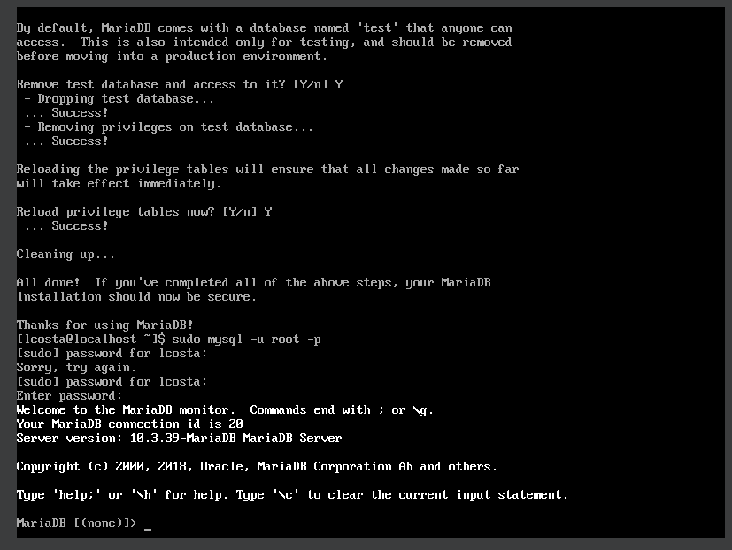
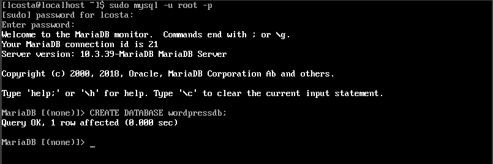
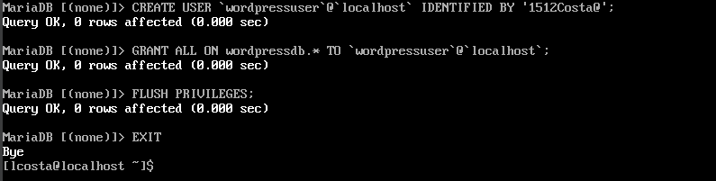

## Desafios anteriores
[Desafio 01](https://github.com/LaraCosta66/compass-linux-d01)

[Desafio 02](https://github.com/LaraCosta66/compass-linux-d02)

## DESAFIO 3

## Instalar LAMP Stack

1. Primeiro é importante atualizar o sistema, para isso use o comando:

```
sudo dnf update
```

### Instalação do Mariadb

1. Para fazer a instalação do _Mariadb_, e do _Apache_

```
sudo dnf install httpd mariadb-server -y
```

- Resetar as configurações padrões do PHP

```
sudo dnf module reset php
```

- Habilitar PHP 7.4 version

```
sudo  dnf module enable php:7.4 -y
```

2. Vamos precisar baixar alguns pacotes para usar O **WordPress** que é baseado em PHP

```
sudo dnf install php php-fpm php-cli php-json php-gd php-mbstring php-pdo php-xml php-mysqlnd php-pecl-zip curl -y
```

3. Iniciar e habilitar as ferramentas

```
sudo systemctl start httpd mariadb php-fpm
sudo systemctl enable httpd mariadb php-fpm
```

4. Instalação segura do _MariaDB_, Esse script fornece uma instalação segura para configurar a senha root e remover usuários anônimos.

```
sudo mysql_secure_installation
```

5. Acessar **MariaDb**

\*Aqui a **senha do root** é a mesma que configurou no **script de segurança\***

```
sudo mysql -u root -p
```



### Criar um Banco de dados para o WordPress

_Configurar o banco de dados:_

```
CREATE DATABASE wordpress;
```


_Criar usuario_

```
CREATE USER `wordpressuser`@`localhost` IDENTIFIED BY 'securepassword';
```

_Conceder todos os privilegios ao User_

```
GRANT ALL ON wordpressdb.* TO `wordpressuser`@`localhost`;
```

_Libere os privilégios e saia_

```
FLUSH PRIVILEGES;
EXIT;
```



## WordPress

1. Vá para o diretório **/var/www/html**, para instalar o **WordPress**

```
cd /var/www/html
sudo curl https://wordpress.org/latest.tar.gz --output wordpress.tar.gz
```

- Depois de concluir o download extraia o arquivo:

```
sudo tar xf wordpress.tar.gz
```

2. Configure o WordPress:

- Mude de para o diretorio _wordpress_ e renomeie o arquivo de configuração do WordPress:

```
cd wordpress
mv wp-config-sample.php wp-config.php
```

3. Abra o arquivo **wp-config.php** e substitua as linhas

```
sudo vi wp-config.php
------------
/** The name of the database for WordPress */
define( 'DB_NAME', 'wordpressdb' );

/** Database username */
define( 'DB_USER', 'wordpressuser' );

/** Database password */
define( 'DB_PASSWORD', 'securepassword' );
```

_Esc :wq (Para salvar o arquivo)_


4. Defina a **Ownership** e **Permissões** de Arquivo:

```
sudo chown -R apache:apache /var/www/html/wordpress
sudo chmod -R 755 /var/www/html/wordpress
```

### Apache:

## Configurar Apache para host do WordPress

- Vamos criar arquivo host virtual **Apache** para hospedar o **Wordpress**

```
sudo vi /etc/httpd/conf.d/wordpress.conf
```

- Adicione nesse arquivo:

```
<VirtualHost *:80>
ServerAdmin root@localhost
ServerName wordpress.example.com
DocumentRoot /var/www/html/wordpress
<Directory "/var/www/html/wordpress">
Options Indexes FollowSymLinks
AllowOverride all
Require all granted
</Directory>
ErrorLog /var/log/httpd/wordpress_error.log
CustomLog /var/log/httpd/wordpress_access.log common
</VirtualHost>
```

_Salve e saia :wq_

- Reinicie o servidor:

```
sudo systemctl restart httpd
```

**Verifique se as regras do firewall estão certas**

```
sudo firewall-cmd --list-all
```

- Para permitir o tráfego em uma porta específica, como a porta 80:

```
sudo firewall-cmd --add-port=80/tcp --permanent
sudo firewall-cmd --reload
```

## No Navegador
