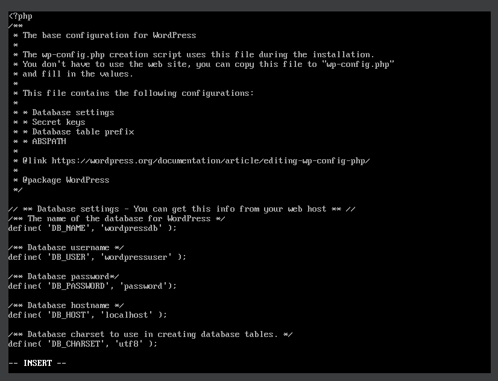

## DESAFIO 3

## Instalar MariaDB na VM1

1. Primeiro é importante atualizar o sistema, para isso use o comando:

```
sudo dnf update
```

### Instalação do Mariadb

1. Para fazer a instalação do _Mariadb_

```
sudo dnf install mariadb-server
```

2. Iniciar e habilitar o **MariaDB**

```
sudo systemctl start mariadb
sudo systemctl enable mariadb
```

3. Instalação segura do _MariaDB_, Esse script fornece uma instalação segura para configurar a senha root e remover usuários anônimos.

```
sudo mysql_secure_installation
```

6. Acessar **MariaDb**

\*Aqui a **senha do root** é a mesma que configurou no **script de segurança\***

```
sudo mysql -u root -p
```


### Criar um Banco de dados para o WordPress

_Configurar o banco de dados:_

```
CREATE DATABASE wordpress;
```


_Criar usuario_

```
CREATE USER `wordpressuser`@`localhost` IDENTIFIED BY 'securepassword';
```

_Conceder todos os privilegios ao User_

```
GRANT ALL ON wordpressdb.* TO `wordpressuser`@`localhost`;
```

_Libere os privilégios e saia_

```
FLUSH PRIVILEGES;
EXIT;
```


## WordPress VM2

1. Vamos precisar baixar alguns pacotes para usar O **WordPress** que é baseado em PHP

```
sudo dnf install php php-fpm php-cli php-json php-gd php-mbstring php-pdo php-xml php-mysqlnd php-pecl-zip curl -y
```

2. Iniciar e habilitar o **PHP-FPM** e o **APACHE** ,

```
´sudo systemctl start httpd php-fpm
sudo systemctl enable httpd php-fpm
```

3. Vá para o diretório **/var/www/html**, para instalar o **WordPress**

```
cd /var/www/html
sudo curl https://wordpress.org/latest.tar.gz --output wordpress.tar.gz
```

- Depois de concluir o download extraia o arquivo:

```
sudo tar xf wordpress.tar.gz
```

4. Configure o WordPress:

- Mude de para o diretorio _wordpress_ e renomeie o arquivo de configuração do WordPress:
```
cd wordpress
mv wp-config-sample.php wp-config.php
```
5. Abra o arquivo **wp-config.php** e substitua as linhas
```
sudo vi wp-config.php
------------
/** The name of the database for WordPress */
define( 'DB_NAME', 'wordpressdb' );

/** Database username */
define( 'DB_USER', 'wordpressuser' );

/** Database password */
define( 'DB_PASSWORD', 'securepassword' );
```


6. Defina as Permissões de Arquivo:
```
sudo chown -R apache:apache /var/www/html/wordpress
sudo chmod -R 755 /var/www/html/wordpress
```

### Configurar o WordPress para Usar o Compartilhamento NFS:
